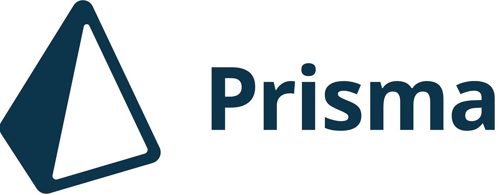

# Welcome to proBoard!


<div style="max-width: 1024px; display: flex; justify-content: center; flex-wrap: wrap; gap: 10px">
  <a href="https://nextjs.org/">
    
  </a>
  <a href="https://react.dev/">
    
  </a>
  <a href="https://www.typescriptlang.org/">
    
  </a>
  <a href="https://www.prisma.io/">
    
  </a>
  <a href="https://www.postgresql.org/">
    
  </a>
  <a href="https://www.docker.com/">
    
  </a>
  <a href="https://tailwindcss.com/">
    
  </a>

</div>

---

## The open-source, kanban-style collaborative software for teams!

---

### Check out the <a href="#">proBoard</a> site and sign in with Google to get started!

---

## Want to check out the code for your self?

There are two methods to run the application locally, both will require a local or cloud-hosted database based on the schema provided in the `/prisma/prisma.schema` file.

- Fork and clone the repo to your local machine

- Run `npm install`

- Set up Google OAuth 2.0 Credentials via the <a href="https://console.cloud.google.com/">Google Developer Console</a>

  - Grab the ClientID and Client Secret

- In the root directory, create a `.env` file and enter the following environment variables:

  ```
  DATABASE_URL="postgresql://<PG_USER>:<PG_PASSWORD>:<host>:5432/<DB_NAME>?schema=public"

  NEXTAUTH_URL=http://localhost:3000
  NEXTAUTH_SECRET=somestringthatcanbeanythingyouwant

  GOOGLE_ID=GoogleIdThatYouCreatedAbove
  GOOGLE_SECRET=GoogleSecretThatYouCreatedAbove

  NEXT_PUBLIC_WS_URL="ws://localhost:3005"
  ```

  - NOTE: The `NEXT_PUBLIC_WS_URL` variable is optional, this is for the <a href="https://github.com/jackmoorman/proboard-wss">WebSocket server repo</a> for proBoard. You can run the application without the server, but also cloning the server repo and running it is recommended for testing and development.

- Running application in Docker conatiner:

  - Build the development Docker image based on the `Dockerfile.dev` using
    ```
    docker build -t proboard/nextjs-image -f Dockerfile-dev .
    ```
  - Or by running `npm run rb-image-dev`

    - This is an npm script for the `docker build` command mentioned above.

  - Now, start the application by running `npm run docker-dev`
    - This starts a PostgresQL development database in the first container
    - After the PSQL container has been started, it will start a container for the proBoard application.
    - You can also do all of this by `docker-compose`-ing yourself:
      ```
      docker-compose -f docker-compose-dev.yml up
      ```

- Running the application un-Dockerized:

  - Make sure you have a PostgresQL database running locally or hosted remotely, and ensure the the `DATABASE_URL` environment variable reflects the correct connection string.

  - `npm run dev`

  - Once the database and development server have been started, open up a separate terminal window and run the following commands:

  ```
  npx prisma generate
  npx prisma migrate dev --name db_init
  ```

  - This project uses <a href="https://www.prisma.io/">Prisma</a> as the ORM to interact with the PostgresQL database.
    - `prisma generate` generates the Prisma client that is used to interact with and query the database.
    - `prisma migrate dev` will create tables in your database based on the models defined in the `/prisma/prisma.schema` file.

---

## Future Plans:

### NOTE: These plans are ever-evolving and are subject to change.

If you have a cool idea that's not on here, start a GitHub discussion or create a feature yourself and submit a pull request!

- Let current active users within the same board be notified when another team member joins the active session.
- Automatically send an email to the invited user when the board owner add's them to the board.
- Themes for both light and dark mode, as well as different theme options that the user can choose from (i.e. lightblue theme, cyan theme, pink theme, red theme, etc.)
- Add more sign-in providers, likely candidates are GitHub, Discord, Facebook, and email sign-up/sign-in.
- Add testing support for existing components (This is a WIP, but new testing features will always be needed as the project grows).
- More coming soon!
